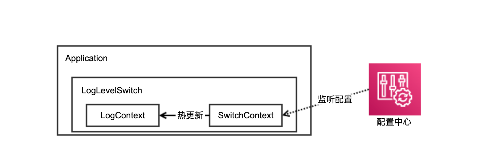
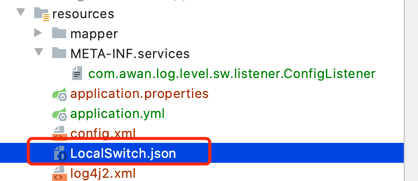

# 1.为什么需要LogLevelSwitch

随着业务规模不断扩大，每一次线上故障的快速定位都是对开发同学的巨大挑战。

通过日志进行业务关键逻辑的输出，是定位问题的有效手段之一。但是，过多的日志记录又会对系统造成额外开销，极端情况下，甚至可能导致系统宕机。

因此，为了兼顾性能和故障场景下的快速定位，我们需要能够实时调整日志等级，以便输出更多的日志信息排查线上问题，或是减少日志打印带来的性能消耗。

基于以上背景，我们的LogLevelSwitch诞生了。

> LogLevleSwitch以中间件的形式嵌入应用，基于配置中心的热更新能力，实现了应用运行时动态调整日志等级的能力。

# 2.功能特性

- **兼容性**：支持Log4j、Log4j2、Logback等。
- **扩展性**：可以使用默认的基于本地配置文件的配置修改方式（**仅供本地测试学习使用**）。生产上，**「强烈推荐」** 通过SPI接入你自己的配置中心，实现热更新。
- **易用性**：接入简单，效果拔群，只要5分钟你就能用上。

# 3.基本架构



在应用Application中引入我们的LogLevelSwitch。

LogLevelSwitch包含两个核心组件，LogContext和SwitchContext。

- SwitchContext: 保存从配置中心获取的switch开关状态与具体Logger配置信息。通过监听配置中心消息，实时更新switch内容，并实现对Logger等级的修改通知。
- LogContext：保存应用原始的Logger与日志级别信息，并能够根据switch配置 更新 或 复原 Logger的等级。

# 4.Quick Start

话不多说了，快来尝尝鲜吧。

# 4.1 普通spring项目

只用三步即可完成。

- STEP 1: 应用中pom引入依赖

```xml

<dependency>
    <groupId>com.awan</groupId>
    <artifactId>log-switch-core</artifactId>
    <version>1.0.0</version>
</dependency>
```

- STEP 2: 构建config Bean

```java 
@Configuration
public class LogLevelSwitchConfig {
    @Bean
    LogLevelSwitch logLevelSwitch() {
        return new LogLevelSwitch();
    }
}
```

- STEP 3: 接入配置中心

声明配置中心的SPI实现。
> 在resource路径下中新建 META-INF/services，创建文件名为com.awan.log.level.sw.listener.ConfigListener的文件，并写入需要的「实现类名」。

**实现一：项目自带的LocalFile配置中心**

如果你还没有自己的配置中心，那就使用我们自带的基于本地配置文件进行本地测试学习。

「实现类名」为com.awan.log.level.sw.listener.LocalFileListener

> 注意，生产上 强烈推荐 通过「实现二」接入你自己的配置中心，实现热更新。


在resource目录下新建LocalSwitch.json文件：



然后填写开关配置：

```json
{
  "status": "on",
  "loggerBeans": [
    {
      "name": "all",
      "level": "error"
    }
  ]
}
```

**实现二：自定义SPI扩展配置,接入自己的配置中心**

如果你已经有了自己的配置中心，那就可以通过SPI扩展配置,接入自己的配置中心。

「实现类名」为你自己的实现类名。

以下是一个参考范例（你也可以参考LocalFileListener的实现）

```java
/**
 * Function:
 * 实现自己的注册中心监听与回调
 * @author awan
 * @date 2022/4/5
 */
public class MyConfigListener extends AbstractConfigListener<Map<String, String>> {
    private static Logger logger = LoggerFactory.getLogger(MyConfigListener.class);

    /**
     * todo 获取开关初始状态
     * @return
     */
    @Override
    public SwitchContext getInitSwitch() {
        logger.info("my listener init");
        return new SwitchContext();
    }

    /**
     * todo 实现自己的配置转化逻辑
     * @param changedConfig
     * @return
     */
    @Override
    public SwitchContext transferConfig(Map<String, String> changedConfig) {
        SwitchContext newContext = new SwitchContext();
        return newContext;
    }

    /**
     * todo 获取自己的配置监听,并调用listenChangedConfig
     * @param changedConfig
     */
    public void listenMyConfigChanged(Map<String, String> changedConfig) {
        listenChangedConfig(changedConfig);
    }

}
```

## 4.2 springboot项目

两步接入。

- STEP 1: 应用中pom引入依赖

```xml

<dependency>
    <groupId>com.awan</groupId>
    <artifactId>log-switch-starter</artifactId>
    <version>1.0.0</version>
</dependency>
```

- STEP 2: 接入配置中心 同「方式一」

# 5.关键配置

SwitchContext是我们的关键配置：

| 参数名 | 含义 | 可选值  |
| --- | --- | --- |
| status | 开关状态  | 「off」: 关闭，使用应用 「on」:开启，使用配置中心的配置等级。  |
| List<LoggerBean> | 日志等级list | 如果列表的第一个LoggerBean的name为all，则影响全局logger等级 |

参考范例：

```json
{
  "status": "on",
  "loggerBeans": [
    {
      "name": "all",
      "level": "error"
    }
  ]
}
```

# 6.注意事项

为了规范日志使用，同时避免影响降级开关效果，初始化的时候会去检测项目中依赖的日志框架实现。

请注意，如果日志提示
> “存在多个日志框架实现，建议只保留一个，否则会影响日志降级开关效果”


说明检测到了应用中引入了多个日志框架实现。

建议从pom中进行移除多余日志框架，确保采用唯一日志框架实现。

